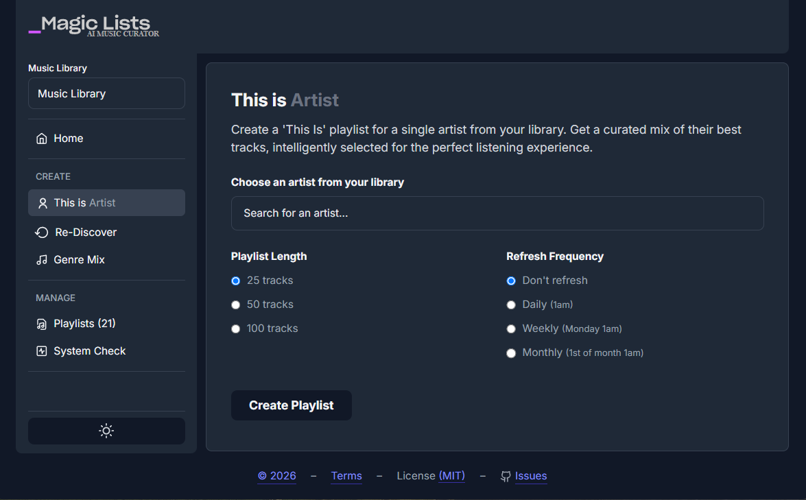
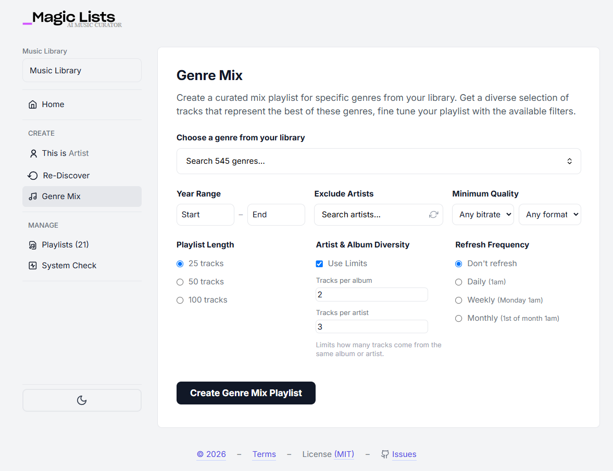

# MagicLists AI Curator

**AI-assisted playlists for your own music library.**

MagicLists adds the kind of curated, evolving playlists you’d expect from Spotify or Apple Music—except it works entirely on your self-hosted Navidrome or Jellyfin server. No subscriptions, no renting your music back. Just smart mixes generated from the library you already own.

## What it does
- 🎵 **This Is (Artist)** — Builds a definitive playlist for any artist in your library, combining hits, deep cuts, and featured appearances without duplicates.
- 🎸 **Genre Mix** — Creates curated playlists from your complete genre collections, using AI to craft the perfect mix of tracks.
- 🔄 **Re-Discover** — Rotates tracks you haven't played in a while, helping you fall back in love with your collection.
- ⏰ **Auto-Refresh** — Keep playlists fresh with daily, weekly, or monthly updates.
- 🐳 **Quick Setup** — Simple Docker install; get started in minutes.

## Why it matters
Navidrome and Jellyfin users already own their music. MagicLists brings modern curation tools into that world—so your playlists feel alive, not static, and your collection keeps surprising you.

## What's that Fork?
This repo is a fork of Ricky Synnot's [magic-lists-for-navidrome](https://github.com/rsynnot/magic-lists-for-navidrome).  
It is an improved version with many bug fixes and more features, including, e.g., Jellyfin implementation, genre mix with advanced filters, dark mode, no usage tracking and many more features...


## Screenshots


_Creating a 'This is (Artist)' playlist_ 



_Creating a 'Genre Mix' playlist_ 


## What’s still a work in progress?
### Some features are still barely or not at all tested, including:
 - Jellyfin Server Client
   - Playlist Generation Quality
   - Schedule of Playlists
   - Support for Big Music Libraries
   - Editing of Playlists
 - Refresh Schedule (time accuracy and actual refresh for Genre Mix and Rediscover playlists)
 - Multi‑library support

Please contribute to the project and report your testing and experience with this application on the Issues tab.

## What’s next
Upcoming features include:
- Multi-artist “radio” blends
- Decade- and discovery-focused lists
- What is on your mind? Open an issue to tell me.


# Installation

### Recommended: Add to Your Existing Docker Compose

**Why this method?** Your MagicLists container will be on the same network as Navidrome, making connection simple and reliable. This also enables future features like audio analysis that require local file access. You also could use this compose to spin up a Szandalone Container.

1. **Add MagicLists to your existing `docker-compose.yml`** (the one that runs Navidrome):
```yaml
   services:
     navidrome:
       # ... your existing Navidrome or Jellyfin config ...
     
     magiclists:
       image: pirus999/magic-lists-ai-curator:latest
       container_name: magiclists
       ports:
         - "4545:8000"
       environment:
         - SERVER_TYPE=navidrome # or jellyfin
         - NAVIDROME_URL=http://navidrome:4533 # for Jellyfin use: JELLYFIN_URL=http://jellyfin:8096
         - NAVIDROME_USERNAME=your_username # for Jellyfin use: JELLYFIN_USERNAME or JELLYFIN_API_KEY
         - NAVIDROME_PASSWORD=your_password # for Jellyfin use: JELLYFIN_PASSWORD or JELLYFIN_API_KEY
         - DATABASE_PATH=/app/data/magiclists.db # Required: Database location
           - AI_PROVIDER=google            # Optional: openrouter, groq, google, ollama
           - AI_API_KEY=your_google_api_key  # Optional, for OpenRouter/Groq/Google
           - AI_MODEL=gemini-3.5-flash # Select one from your AI provider
           - DESCRIPTION_AI_MODEL=gemma-4-26b-a4b-it # Optional, select a smaller model for Playlist descriptions
       volumes:
         - ./magiclists-data:/app/data          # Persist configuration
       restart: unless-stopped
```
2. Update the environment variables with your Navidrome credentials
3. Start the stack:
```bash
   docker-compose up -d
```
4. Access MagicLists at http://localhost:4545

Note: The NAVIDROME_URL uses the container name (navidrome) as the hostname. If your Navidrome service has a different name in your compose file, update this accordingly.

### Alternative: Standalone Docker Run Container
Use this if you can't or don't want to modify your existing Docker Compose setup.

**Docker Run If Navidrome is publicly accessible:**
Use your public Navidrome URL (e.g., https://music.yourdomain.com):
```bash
   docker run -d \
      --name magiclists \
      -p 4545:8000 \
      -e NAVIDROME_URL=https://music.yourdomain.com \
      -e NAVIDROME_USERNAME=your_username \
      -e NAVIDROME_PASSWORD=your_password \
      -e DATABASE_PATH=/app/data/magiclists.db \
      -e AI_PROVIDER=openrouter \
      -e AI_API_KEY=your_openrouter_api_key \
      -e AI_MODEL=dots-studio/dots-3-note-preview:free \
      -v ./magiclists-data:/app/data \
      pirus999/magic-lists-ai-curator:latest
```


## Running Without Docker
Use this method if you prefer to run Python directly or want to contribute to development.

1. Clone the repository:
```bash
   git clone https://github.com/pirus99/magic-lists-ai-curator
   cd magic-lists-ai-curator
```
2. Install dependencies:
```bash
   pip install -r requirements.txt
```
3. Create your environment file:
```bash
   cp .env.example .env
```
4. Edit `.env` with your Navidrome details:
```bash
   NAVIDROME_URL=http://localhost:4533
   NAVIDROME_USERNAME=your_username
   NAVIDROME_PASSWORD=your_password
    DATABASE_PATH=./magiclists.db        # Required: Database location
    AI_PROVIDER=google              # Optional: openrouter, groq, google, ollama
    AI_API_KEY=your_google_ai_studio_api_key  # for OpenRouter/Groq/Google
    AI_MODEL=gemini-3.5-flash # Use a high tier Instruct or low tier Reasoning model for best results
    DESCRIPTION_AI_MODEL=gemma-4-26b-a4b-it # Optional
```
5. Run the application:
```bash
    python -m uvicorn app.main:app --host 0.0.0.0 --port 4545
```
6. Access the application at http://localhost:4545
To update: Simply `git pull` and restart the application.


## AI Configuration

MagicLists supports multiple AI providers for enhanced playlist curation:

1. **Fallback-only** (Free) - Uses play count and metadata sorting
2. **Local LLM** (Free) - Run models locally with Ollama
3. **OpenRouter** (Free/Paid) - Access to various cloud models including free options
4. **Google AI** (Free) - Google's Gemini models with generous free quota
5. **Groq** (Free/Paid) - Fast cloud models with no credit card required

### Option 2: Local LLM (Ollama)
[Install Ollama](https://ollama.com) and run models locally:

```bash
# Install and run a model
ollama pull llamusic
ollama serve

# .env configuration
AI_PROVIDER=ollama
AI_MODEL=llamusic
OLLAMA_BASE_URL=http://localhost:11434/v1/chat/completions
OLLAMA_MAX_TRACKS=180 #Lower when having ai response problems
# For Docker: OLLAMA_BASE_URL=http://host.docker.internal:11434/v1/chat/completions
# OLLAMA_TIMEOUT=300  # Increase for slower CPUs (default: 180 seconds)
```

### Option 3: OpenRouter (Cloud Models)
Get an API key from [OpenRouter](https://openrouter.ai) ($5 minimum):

```bash
# .env configuration
AI_PROVIDER=openrouter
AI_API_KEY=sk-or-v1-your-key-here
AI_MODEL=dots-studio/dots-3-note-preview:free    # Free model
# AI_MODEL=tencent/hy3                  # Paid model
DESCRIPTION_AI_MODEL=google/gemma-4-26b-a4b-it:free
```

### Option 4: Google AI (Free & Generous Quota)
Get a free API key from [Google AI Studio](https://ai.google.dev/) - no credit card required:

```bash
# .env configuration
AI_PROVIDER=google
AI_API_KEY=AIzaSy_your-google-key-here
AI_MODEL=gemini-3.5-flash               # Fast and capable
# AI_MODEL=gemini-3.1-pro               # More advanced model
DESCRIPTION_AI_MODEL=gemma-4-26b-a4b-it
```

### Option 5: Groq (Free/Paid)
Get a free API key from [Groq](https://console.groq.com/) - no credit card required:

```bash
# .env configuration
AI_PROVIDER=groq
AI_API_KEY=gsk_your-groq-key-here
AI_MODEL=openai/gpt-oss-20b             # Fast default model
# AI_MODEL=llama-3.3-70b-versatile      # Alternative model
DESCRIPTION_AI_MODEL=llama-3.1-8b-instant
```

**Note:** Without AI configuration, the app falls back to play-count based playlist generation.


## Environment 

| Section | Variable | Example / Default | What it does | Required? |
|--------|----------|-------------------|--------------|-----------|
| **Server selection** | `SERVER_TYPE` | `navidrome` *(or `jellyfin`)* | Chooses which music server the app talks to. | **Yes** – defaults to `navidrome`. |
| **Navidrome settings** | `NAVIDROME_URL` | `http://navidrome:4533` | Base URL of the Navidrome instance. | Required **if** `SERVER_TYPE=navidrome`. |
| | `NAVIDROME_USERNAME` | `your_navidrome_username` | Navidrome user name. | Required **if** Navidrome. |
| | `NAVIDROME_PASSWORD` | `your_password` | Navidrome password (plain‑text – the container runs in a trusted environment). | Required **if** Navidrome. |
| **Jellyfin settings** | `JELLYFIN_URL` | `http://jellyfin:8096` | Base URL of the Jellyfin instance. | Required **if** `SERVER_TYPE=jellyfin`. |
| | `JELLYFIN_USERNAME` | `admin` | Jellyfin user name. | Required **if** Jellyfin. |
| | `JELLYFIN_PASSWORD` | `password` | Jellyfin password. | Required **if** Jellyfin. |
| | `JELLYFIN_API_KEY` | *(empty)* | API key for token‑based auth (optional – password auth works too). | Optional. |
| | `JELLYFIN_VERIFY_SSL` | `true` | Verify TLS certs when using `https`. Set to `false` for self‑signed certs. | Optional. |
| **ListenBrainz Labs (artist‑radio)** | `LISTENBRAINZ_LABS_URL` | `https://labs.api.listenbrainz.org` | Endpoint used for “artist radio” suggestions. | Fixed – leave as‑is. |
| | `LISTENBRAINZ_TOKEN` | *(empty)* | Personal token – only needed when you hit rate‑limits. | Optional. |
| | `LISTENBRAINZ_TIMEOUT` | `15` (seconds) | HTTP timeout for ListenBrainz calls. | Optional. |
| **AI Provider** | `AI_PROVIDER` | `google` *(options: `openrouter`, `groq`, `google`, `ollama`)* | Which LLM service to call for playlist curation. | **Yes**. |
| | `AI_API_KEY` | `your_api_key_here` | Provider‑specific API key (OpenRouter, Groq, Google). Not needed for Ollama. | **Yes** for all non‑Ollama providers. |
| **LLM Model** | `AI_MODEL` | `gemini-3.5-flash` | The “heavy” model that does the actual playlist generation / reasoning. Choose a model that matches the provider you picked. | **Yes**. |
| **Description‑only Model** | `DESCRIPTION_AI_MODEL` | `gemma-4-26b-a4b-it` | A cheaper / faster model used **only** for short description generation (e.g., “Genre Mix”, “This is a playlist” text). If left empty, `AI_MODEL` is reused. | Optional. |
| **Ollama‑specific settings** *(ignored unless `AI_PROVIDER=ollama`)* | `OLLAMA_BASE_URL` | `http://localhost:11434/v1/chat/completions` | URL of the local Ollama server. Adjust when running inside Docker (`host.docker.internal`) or via a separate compose service. | Optional – required for Ollama. |
| | `OLLAMA_TIMEOUT` | `180` (seconds) | HTTP request timeout for Ollama. Raise for slow CPUs or huge prompts. | Optional. |
| | `OLLAMA_MAX_TRACKS` | `150` | Hard cap on how many tracks are sent to the LLM (prevents context‑size overflow). Leave empty for the automatic dynamic limit. | Optional. |
| **Filesystem & persistence** | `DATABASE_PATH` | `/app/data/magiclists.db` | Where the SQLite DB lives inside the container. For Docker you normally mount a volume at `/app/data`. | Yes – defaults to the internal path. |
| **Logging** | `LOG_LEVEL` | `INFO` *(options: `ERROR`, `INFO`, `DEBUG`)* | Verbosity of the app’s log output. | Optional. |
| **Navidrome library filter** | `NAVIDROME_LIBRARY_ID` | *(empty)* | If you have multiple Navidrome libraries, set the ID to limit the app to one. | Optional. |


## System Check Page 

MagicLists automatically validates your configuration on startup. If any issues are detected, you'll be redirected to a system check page that shows:

- **Environment Variables**: Checks that required variables are set
- **Navidrome URL**: Verifies your server is reachable  
- **Navidrome Authentication**: Tests your credentials
- **Navidrome Artists API**: Confirms API access is working
- **AI Provider**: Checks if AI features are configured (OpenRouter, Groq, Google AI, or Ollama)
- **Library Configuration**: Shows multiple library setup status

If checks fail, detailed suggestions are provided to help resolve issues. You can also access the system check at any time via `/system-check`.


# Troubleshooting

### Database Write Errors (500 Server Error)
If system checks pass but playlist creation fails with a 500 error about database write permissions:

**Solution**: Ensure `DATABASE_PATH` environment variable is set:
- **Docker**: `DATABASE_PATH=/app/data/magiclists.db` (with volume mounted to `/app/data`)
- **Standalone**: `DATABASE_PATH=./magiclists.db` (in your project directory)

This is **required** for the application to persist playlist data and user settings.

### Connection Issues

Can't connect to Navidrome? The most common issue is an incorrect `NAVIDROME_URL`. Here's how to determine the right value:
- Same Docker network: Use the container name (e.g., http://navidrome:4533)
- Same host machine: Use http://host.docker.internal:4533 (Docker Desktop) or http://172.17.0.1:4533 (Linux)
- Different machine on LAN: Use the local IP (e.g., http://192.168.1.100:4533)
- Public internet: Use your domain (e.g., https://music.yourdomain.com)

**Check if containers are on the same network:**
```bash
   # List Docker networks
   docker network ls

   # Inspect your network
   docker network inspect your_network_name

   # Verify both containers are on the same network
   docker ps --format "table {{.Names}}\t{{.Networks}}"
```

**No artists found**
   - Ensure your music library is scanned in Navidrome
   - Check Navidrome logs for scanning issues
   - If using multiple libraries, verify the library ID is correct

**Database errors**
   - Ensure write permissions for database directory
   - Check disk space
   - Restart the application if database appears corrupted

**Still having issues?** Check the System Check page in the app after startup - it will test your connection and provide specific guidance.

### AI Response Issues

If AI is responding with its reasoning/context or gives empty responses:
- Try another model
- Try selecting a shorter playlist length
then try:
1. To add a volume mount for recipes in the Docker container
```bash
   volumes:
      - HOST_PATH_FOR_YOUR_RECIPES:/app/recipes
```
2. Edit the maximum Tokens for the required Recipe, or vary with model temperature till you get good results.
**More Info:** See [README](recipes/README.md) in recipes folder

### Playlist Length Issues
   - Ensure you have enough tracks for the requested artist/genre
   - View your logs to ensure your filtering options are not dropping all tracks
   - Adjust filtering to allow enough tracks to be sent to AI curation

### Issues with Editing Playlists
   - Make sure you have created the playlist with a version of MagicLists that allows playlist editing (>= 1.1.0).
   - Delete and recreate the playlist from scratch with a new version of MagicLists to enable editing features for the playlist.

### Other Issues
   - If you need Help and encounter Bugs or Issues open an Issue on the [Issue](https://github.com/pirus99/magic-lists-ai-curator/issues/new/choose) Tab

## API Endpoints

- `GET /` - Web interface
- `GET /system-check` - System check / health diagnostics page
- `GET /api/artists` - List all artists from Navidrome
- `GET /api/genres` - List all genres from Navidrome
- `GET /api/artists-by-genre` - List artists for a given genre
- `GET /api/music-folders` - List available music folders/libraries
- `GET /api/health-check` - Run system health checks (returns JSON status)
- `POST /api/create_playlist` - Create a new "This Is" playlist
- `POST /api/create_playlist_with_description` - Create playlist with an AI-generated description
- `POST /api/create_genre_playlist` - Create a curated genre mix playlist
- `GET /api/rediscover-weekly` - Generate Re-Discover Weekly recommendations
- `GET /api/rediscover-weekly-v2` - Generate Re-Discover Weekly recommendations (v2)
- `POST /api/create-rediscover-playlist` - Create Re-Discover Weekly playlist in Navidrome
- `POST /api/create-rediscover-playlist-v2` - Create Re-Discover Weekly playlist in Navidrome (v2)
- `GET /api/playlists` - List all managed playlists
- `DELETE /api/playlists/{playlist_id}` - Delete a managed playlist
- `GET /api/recipes` - List available recipe versions
- `GET /api/recipes/validate` - Validate recipe configurations
- `GET /api/scheduler/status` - Check auto-refresh scheduler status
- `POST /api/scheduler/trigger` - Manually trigger scheduled refreshes
- `POST /api/scheduler/start` - Start the auto-refresh scheduler
- `GET /api/ai-model-info` - Get information about the configured AI model
- `POST /api/track-library-size` - Get the size of the track library


## License

MIT License - see LICENSE file for details.

## Contributing

1. Fork the repository
2. Create a feature branch
3. Make your changes
4. Add tests if applicable
5. Submit a pull request

## 📈 Usage Analytics

This fork of the Project currently does not use any usage analytics.

## Support

For issues and questions:
- Check the troubleshooting section
- Review Navidrome or Jellyfin documentation
- Create an issue in the repository

## Legal Disclaimer

**No Warranty**: This software is provided "as is" without warranty of any kind, express or implied.

**User Responsibility**: You are solely responsible for:
- Ensuring you have proper rights to any music content processed through this application
- Any data transmitted to third-party AI services
- Backup of your music library before use
- Any modifications made to your playlists or library

**Limitation of Liability**: The developers shall not be liable for any damages including but not limited to data loss, corruption of music libraries, or any other direct or indirect damages arising from use of this software.

**Third-party Services**: This application integrates with external AI services. Your use of these services is subject to their respective terms of service.

By using this software, you acknowledge and accept these terms. 

---

© 2026 Miles Pickull — Licensed under the MIT License.