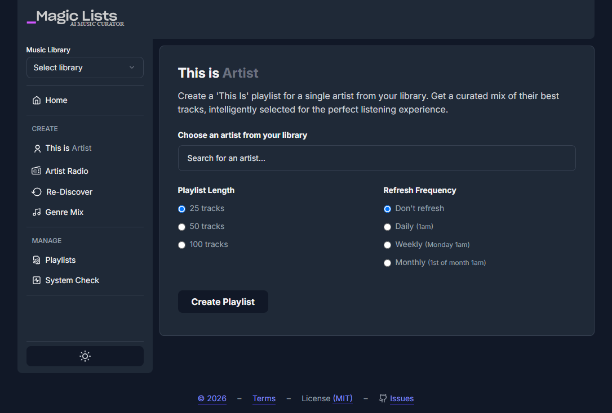
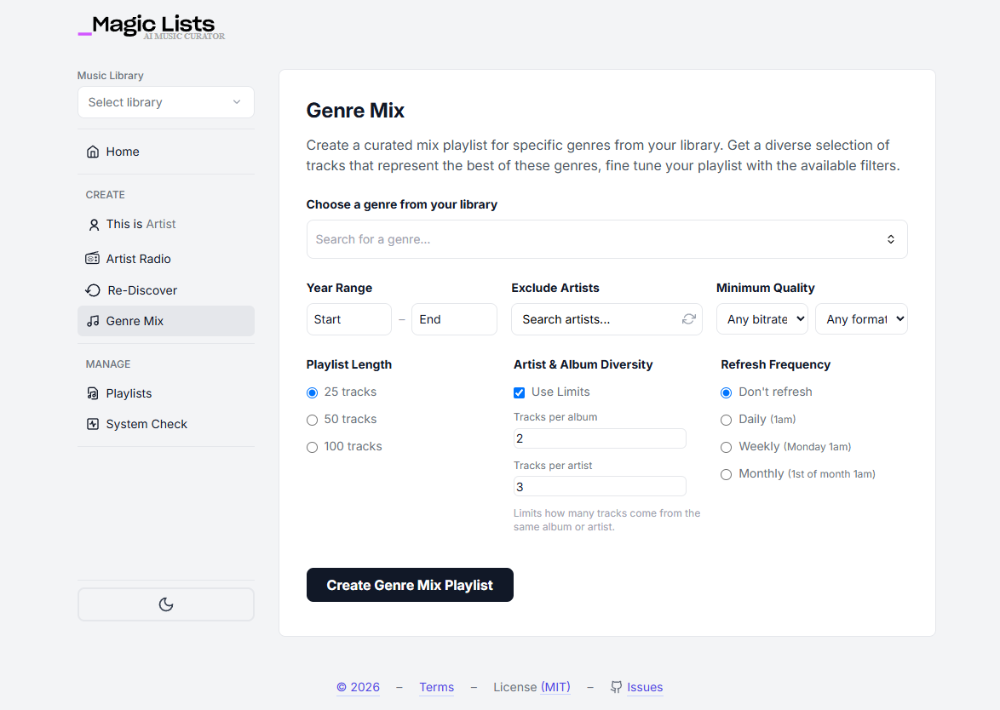

# MagicLists AI Curator

**AI-assisted playlists for your own music library.**

MagicLists adds the kind of curated, evolving playlists you’d expect from Spotify or Apple Music—except it works entirely on your self-hosted Navidrome or Jellyfin server. No subscriptions, no renting your music back. Just smart mixes generated from the library you already own.

## What it does
- 🎵 **This Is (Artist)** — Builds a definitive playlist for any artist in your library, combining hits, deep cuts, and featured appearances without duplicates.
- 📻 **Artist Radio** — Automatically search for similar artists for your selected one, then create a distinctive mixed radio playlist from your selection.
- 🎸 **Genre Mix** — Creates curated playlists from your complete genre collections, using AI to craft the perfect mix of tracks.
- 🔄 **Re-Discover** — Rotates tracks you haven't played in a while, helping you fall back in love with your collection.
- ⏰ **Auto-Refresh** — Keep playlists fresh with daily, weekly, or monthly updates.
- 🐳 **Quick Setup** — Simple Docker install; get started in minutes.

## Why it matters
Navidrome and Jellyfin users already own their music. MagicLists brings modern curation tools into that world—so your playlists feel alive, not static, and your collection keeps surprising you.

## What's that Fork?
This repo is a fork of Ricky Synnot's [magic-lists-for-navidrome](https://github.com/rsynnot/magic-lists-for-navidrome).  
It is an improved version with many bug fixes and more features, including, e.g., Jellyfin implementation, artist radio, genre mix with advanced filters, dark mode, no usage tracking and many more features...


## Screenshots


_Creating a 'This is (Artist)' playlist_ 



_Creating a 'Genre Mix' playlist_ 


## What’s still a work in progress?
### Some features are still barely or not at all tested, including:
 - Jellyfin Server Client
   - Artist Radio Similarity Check
   - Playlist Generation Quality
   - Support for Big Music Libraries

Please contribute to the project and report your testing and experience with this application on the Issues tab.

## What’s next
Upcoming features include:
- An updated scheduling for regeneration of Playlists
- What is on your mind? Open an issue to tell me.


# 📖 Documentation Index

All setup and troubleshooting instructions now live in the [`docs/`](docs/) folder. Pick the path that matches your setup and jump straight to it.

## 🚀 Installation

| I want to… | Guide |
|---|---|
| **Add MagicLists to my existing Docker Compose (recommended)** | **[`docs/DOCKER.md`](docs/DOCKER.md)** |
| Run a standalone container with `docker run` | **[`docs/DOCKER.md` → Standalone Docker Run](docs/DOCKER.md#standalone-docker-run)** |
| Compare install methods / not sure where to start | **[`docs/INSTALLATION.md`](docs/INSTALLATION.md)** |
| Develop or contribute from source | **[`docs/RUNNING_LOCALLY.md`](docs/RUNNING_LOCALLY.md)** |

> **Recommended: Docker Compose.** Your MagicLists container joins the **same network** as Navidrome/Jellyfin, so the connection is simple and reliable — no host ports, no `host.docker.internal`. It's also the only setup that unlocks future features needing local file access, such as audio analysis, and a single-service compose file doubles as a clean standalone stack.

## 🎵 Server Setup

| My server | Guide |
|---|---|
| **Navidrome** | **[`docs/NAVIDROME.md`](docs/NAVIDROME.md)** |
| **Jellyfin** | **[`docs/JELLYFIN.md`](docs/JELLYFIN.md)** |

## 🤖 AI Configuration

| I want to… | Guide |
|---|---|
| **Choose an AI provider (start here)** | **[`docs/AI_PROVIDERS.md`](docs/AI_PROVIDERS.md)** |
| ⭐ **Recommended setup** | Google AI Studio — `AI_PROVIDER=google`, `AI_MODEL=gemini-3.1-flash-lite`, `DESCRIPTION_AI_MODEL=gemma-4-26b-a4b-it` |
| Run fully local & private | [Ollama](docs/AI_PROVIDERS.md#option-2--local-llm-ollama) |
| Use a different cloud provider | [OpenRouter](docs/AI_PROVIDERS.md#option-4--openrouter) · [Groq](docs/AI_PROVIDERS.md#option-5--groq) |

> **Why Google?** The free tier is generous, **no credit card is required**, and one API key is all you need. `gemini-3.1-flash-lite` is fast and handles large track lists comfortably; `gemma-4-26b-a4b-it` is small and quick, used only for playlist descriptions.

## 🔧 Reference & Help

| I need… | Guide |
|---|---|
| Look up an environment variable | **[`docs/ENVIRONMENT.md`](docs/ENVIRONMENT.md)** |
| Fix something that isn't working | **[`docs/TROUBLESHOOTING.md`](docs/TROUBLESHOOTING.md)** |
| Tune the AI prompt recipes | **[`recipes/README.md`](recipes/README.md)** |
| Use the REST API | **[`docs/API.md`](docs/API.md)** |

## ⚡ The 60-second version (Docker Compose)

```yaml
services:
  magiclists:
    image: pirus999/magic-lists-ai-curator:latest
    container_name: magiclists
    ports:
      - "4545:8000"
    environment:
      - SERVER_TYPE=navidrome                  # or: jellyfin
      - NAVIDROME_URL=http://navidrome:4533   # Jellyfin: JELLYFIN_URL=http://jellyfin:8096
      - NAVIDROME_USERNAME=your_username       # Jellyfin: JELLYFIN_USERNAME or JELLYFIN_API_KEY
      - NAVIDROME_PASSWORD=your_password       # Jellyfin: JELLYFIN_PASSWORD or JELLYFIN_API_KEY
      - DATABASE_PATH=/app/data/magiclists.db # Required: database location
      - AI_PROVIDER=google                     # openrouter, groq, google, ollama
      - AI_API_KEY=your_google_api_key
      - AI_MODEL=gemini-3.1-flash-lite
      - DESCRIPTION_AI_MODEL=gemma-4-26b-a4b-it
      - LASTFM_API_KEY=your_lastfm_key        # Optional: Jellyfin top tracks via Last.fm
    volumes:
      - ./magiclists-data:/app/data           # Persist database + settings
    restart: unless-stopped
```

```bash
mkdir -p magiclists-data
docker compose up -d
```

Then open **http://localhost:4545** and verify everything at **http://localhost:4545/system-check**.

### Artist top tracks

The **Top Tracks per Artist** slider on the This Is and Artist Radio pages is powered by a different
source depending on your server, and the UI shows which one is active:

| Server | Source | Label | Requires |
|---|---|---|---|
| Navidrome | Native `getTopSongs` endpoint | `Native` | Nothing |
| Jellyfin | [Last.fm](https://www.last.fm/api) `artist.getTopTracks` | `Last.fm` | `LASTFM_API_KEY` |
| Either, unconfigured/unavailable | None — falls back to play-count ordering | `Off` | — |

Jellyfin has no equivalent of Navidrome's top-songs endpoint, so set `LASTFM_API_KEY` to a free key from
[last.fm/api/account/create](https://www.last.fm/api/account/create) to enable it. Last.fm returns song
titles rather than server IDs, so MagicLists matches them against the artist's tracks already in your
library; only matched tracks are used. If Last.fm is unconfigured or unreachable, playlists are still
built — just ordered by play count — so a missing key never blocks you.

The same key powers a **manual artist fallback** on the This Is page: if an artist is missing from the
library list or has no MusicBrainz ID, enter their name (or MBID) and Last.fm resolves it. The artist
must still exist in your library, since the playlist is built from its local tracks.

See [docs/JELLYFIN.md](docs/JELLYFIN.md) for details and [docs/API.md](docs/API.md) for
`GET /api/top-tracks/strategies`.

👉 Full instructions: **[`docs/DOCKER.md`](docs/DOCKER.md)**

## 🩺 System Check Page

MagicLists validates its configuration on startup. If anything is misconfigured you're redirected to a system check page that validates:

- **Environment Variables** — that required variables are set
- **Server URL** — that Navidrome or Jellyfin is reachable
- **Authentication** — that your credentials work
- **Artists API** — that API access returns results
- **AI Provider** — that AI features are configured (Google, OpenRouter, Groq, or Ollama)
- **Library Configuration** — multiple-library setup status

Failed checks come with a suggested fix. You can also visit `/system-check` at any time:

```bash
curl "http://localhost:4545/system-check"
```

## API

MagicLists exposes a REST API for all playlist features. FastAPI also serves interactive documentation at `/docs` (Swagger UI) and `/redoc` once the app is running.

📖 **See the full [API Reference](docs/API.md)** for every endpoint, with all query parameters, request body fields, defaults, and validation rules.


## License

MIT License - see LICENSE file for details.

## Contributing

1. Fork the repository
2. Create a feature branch
3. Make your changes
4. Add tests if applicable
5. Submit a pull request

## 📈 Usage Analytics

This fork of the Project currently does not use any usage analytics.

## Support

For issues and questions:
- Run the built-in check at `http://localhost:4545/system-check`
- Check the [troubleshooting guide](docs/TROUBLESHOOTING.md)
- Look up your variables in the [environment reference](docs/ENVIRONMENT.md)
- Review Navidrome or Jellyfin documentation
- Create an issue in the repository

## Legal Disclaimer

**No Warranty**: This software is provided "as is" without warranty of any kind, express or implied.

**User Responsibility**: You are solely responsible for:
- Ensuring you have proper rights to any music content processed through this application
- Any data transmitted to third-party AI services
- Backup of your music library before use
- Any modifications made to your playlists or library

**Limitation of Liability**: The developers shall not be liable for any damages including but not limited to data loss, corruption of music libraries, or any other direct or indirect damages arising from use of this software.

**Third-party Services**: This application integrates with external AI services. Your use of these services is subject to their respective terms of service.

By using this software, you acknowledge and accept these terms. 

---

© 2026 Miles Pickull — Licensed under the MIT License.